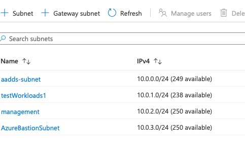
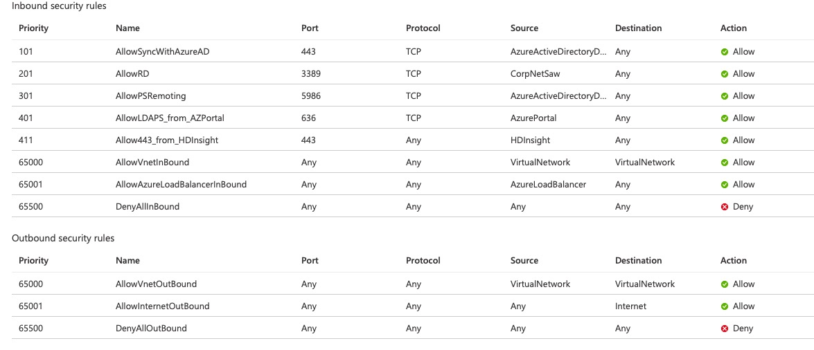
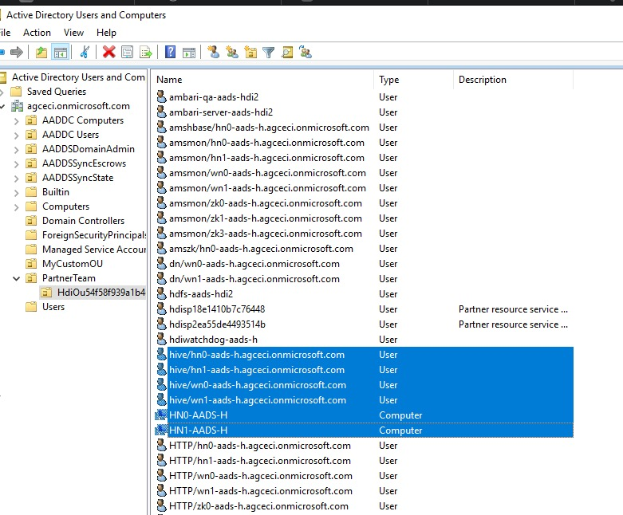
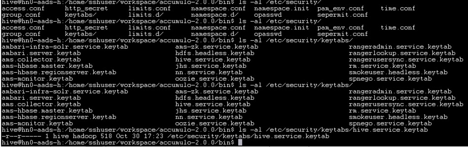

# Accumulo integrated with Azure Active Directory (AAD) and Domain Service, with Azure HDInsight Dependency

## Setup your AAD Domain Services managed domain
A step-by-step tutorials are available to set up a Azure Active Directory Domain Services managed domain (https://docs.microsoft.com/en-us/azure/active-directory-domain-services/tutorial-create-instance, https://docs.microsoft.com/en-us/azure/active-directory-domain-services/tutorial-create-instance-advanced). Then, add a domain-join a windows server (https://docs.microsoft.com/en-us/azure/active-directory-domain-services/join-windows-vm), install management tools (https://docs.microsoft.com/en-us/azure/active-directory-domain-services/tutorial-create-management-vm), and configure secure LDAP (https://docs.microsoft.com/en-us/azure/active-directory-domain-services/tutorial-configure-ldaps).

## DNS name and self-signed certificat for your domain (`**For testing only**`)
In case you just want to evaluate and don't want to use a custom domain, you may still be able to use a self-signed certificate with DNS name having your onmicrosoft.com domain name.  For example, given your onmicrosoft.com domain name is `agceci.onmicrosoft.com`, the powershell script would be like

```
# Define your own DNS name used by your managed domain
$dnsName="agceci.onmicrosoft.com"
# Get the current date to set a one-year expiration
$lifetime=Get-Date
# Create a self-signed certificate for use with Azure AD DS
New-SelfSignedCertificate -Subject $dnsName `
  -NotAfter $lifetime.AddDays(365) -KeyUsage DigitalSignature, KeyEncipherment `
  -Type SSLServerAuthentication -DnsName *.$dnsName, $dnsName
```

A certificate (either from public CA or self-certificate) is needed to enable secure LDAP and thus to enable ESP in HDInsight (https://docs.microsoft.com/en-us/azure/active-directory-domain-services/tutorial-configure-ldaps#enable-secure-ldap-for-azure-ad-ds). For ldap configuration validation, you also need to export the certifcate (https://docs.microsoft.com/en-us/azure/active-directory-domain-services/tutorial-configure-ldaps#export-a-certificate-for-client-computers) and import it as a trusted certificate later.

## Separate VNET subnet for Azure AD DS, workload, management, and Bastion host
Azure AD DS is required to be set up in a separate subnet in the VNET. If you share the same VNET with workload and management according to the tutorial document (https://docs.microsoft.com/en-us/azure/active-directory-domain-services/tutorial-configure-networking), you should set up separate VNET subnets for workload and management. Below shows subnets I set up for my experiment.


## Open ports for HDInsight and setup issues
We also need to open network ports for HDInsight, that are blocked by network security group (NSG). Use NSG service tags (AzurePortal and HDInsight) for opening ports.  In the example below, we opened 636 and 443.


## Create a managed identity and configure network for ESP
We need to enable Azure AD DS, create a managed identity, and network setup for DNS and related issues. Follow the step-by-step tasks described in this document (https://docs.microsoft.com/en-us/azure/hdinsight/domain-joined/apache-domain-joined-configure-using-azure-adds).

## Create HDInsight cluster and admin account in Azure AD
Decide which existing cloud-only account will be used or create one for HDInsight cluster admin in Azure AD. And, create a new security group that you may use for cluster access group. In the experiment, we create 'accumulo@agceci.onmicrosoft.com' and POC2-group in Azure AD using Azure Portal. Note that you may need to change the password of that admin account in order to trigger synchronization & make its hashed password available in Azure AD domain services (https://myaccount.microsoft.com).
 
Choose ESP and HDInsight ID Broker option in `Security + network` (https://docs.microsoft.com/en-us/azure/hdinsight/domain-joined/apache-domain-joined-configure-using-azure-adds#create-an-hdinsight-cluster-with-esp).  And select the user-assigned managed identity created in the previous step (i.e. create a managed identity in configuring ESP cluster).

## Install Accumulo and configure
HDInsight has the feature to install other apache software and customize the cluster using script action (https://docs.microsoft.com/en-us/azure/hdinsight/hdinsight-hadoop-customize-cluster-linux). In the future, we will revisit how we install and configure Apache accumulo. For simplicity, we will login into the first head node of HDInsight cluster and shows how we run a single-node accumulo.
To login to HDInsight, use `sshuser` and your custer name.
```
ssh -l sshuser $HDInsightClusterName-ssh.azurehdinsight.net # the first head node 
 # ssh -l sshuser $HDInsightClusterName-ssh.azurehdinsight.net -p 23 # the second head node
```

Check if you are able to do Kerberos authentication with kinit. Note that domain name is capital and we use accumulo as an administrator account for our HDInsight cluster in this example.
```
kinit -V accumulo@AGCECI.ONMICROSOFT.COM
klist
```

Build accumulo from source and download into the vm. Build from source is needed since the Kerberos renewal from keytab file is available in recent patch (). For simplicity, I will show the download instruction from release, but you should update the URL based on your build and its release location.

```
wget "https://mirror.olnevhost.net/pub/apache//accumulo/2.0.0/accumulo-2.0.0-bin.tar.gz"
tar xzf /path/to/accumulo-2.0.0-bin.tar.gz
cd accumulo-2.0.0
```

Set HADOOP_HOME and ZOOKEEPER_HOME environment for accumulo in both sshuser and hive account.


Set HADOOP_HOME and ZOOKEEPER_HOME environment for accumulo in both sshuser and hive account.
```
export HADOOP_HOME=/usr/hdp/current/hadoop-client
export ZOOKEEPER_HOME=/usr/hdp/current/zookeeper-client
export HADOOP_CONF_DIR=${​​​​​​HADOOP_HOME}​​​​​​/conf
export CLASSPATH="${CLASSPATH}:${lib}/*:${HADOOP_CONF_DIR}:${ZOOKEEPER_HOME}/*:${HADOOP_HOME}/client/*:${HADOOP_HOME}/*:/usr/hdp/current/hadoop-hdfs-client/*:/usr/hdp/current/hadoop-hdfs-client/lib/*"
```

Update configurations in conf/accumulo.properties with the correct domain names, kerberos configurations, and zk configurations in your HDInsight cluster. Below is an example with 'agceci.onmicrosoft.com' domain name. Note that in this example, kerberos.keytab file is pointing to /etc/security/keytabs/hive.service.keytab, which is open to hive user account and hadoop group.

```
instance.volumes=hdfs://mycluster/accumulo

## Sets location of Zookeepers
instance.zookeeper.host=zk0-aads-h.agceci.onmicrosoft.com:2181,zk1-aads-h.agceci.onmicrosoft.com:2181,zk3-aads-h.agceci.onmicrosoft.com:2181

## Change secret before initialization. All Accumulo servers must have same secret
instance.secret=DEFAULT
instance.security.authenticator=org.apache.accumulo.server.security.handler.KerberosAuthenticator
instance.security.authorizor=org.apache.accumulo.server.security.handler.KerberosAuthorizor
instance.security.permissionHandler=org.apache.accumulo.server.security.handler.KerberosPermissionHandler

general.kerberos.keytab=/etc/security/keytabs/hive.service.keytab
general.kerberos.principal=hive/_HOST@AGCECI.ONMICROSOFT.COM
instance.rpc.sasl.enabled=true
rpc.sasl.qop=auth
## Set to false if 'accumulo-util build-native' fails
tserver.memory.maps.native.enabled=false

trace.token.type=org.apache.accumulo.core.client.security.tokens.KerberosToken
## Trace user
trace.user=hive/_HOST@AGCECI.ONMICROSOFT.COM

## Trace password
#trace.password=secret
trace.token.property.keytab=/etc/security/keytabs/hive.service.keytab

general.delegation.token.lifetime=7d
general.delegation.token.update.interval=1d
```
Update configurations in conf/accumulo-client.properties with the cloud-only account you intended for kerberos authentication. In the example, we are going to use 'accumulo@AGCECI.ONMICROSOFT.COM'. Note that auth.token is pointing to users's keytab cache file we grab from klist command output after kinit command.

```
instance.name=accumulo
instance.zookeepers=zk0-aads-h.agceci.onmicrosoft.com:2181,zk1-aads-h.agceci.onmicrosoft.com:2181,zk3-aads-h.agceci.onmicrosoft.com:2181
auth.type=kerberos
auth.principal=accumulo@AGCECI.ONMICROSOFT.COM
auth.token=/tmp/krb5cc_2020
sasl.enabled=true
sasl.kerberos.server.primary=hive
sasl.qop=auth
```

## Review Service principals, and key tab files generated in HDInsight with ESP
HDInsight with ESP sets up a set of service principals and their corresponding linux accounts in order to run supported services. The corresponding kerberos key tab files for each service principals are protected thru Linux access policy enforcement. We will figure out later how we create a service principal for accumulo, but for this experiment, we used hive service principal to run accumulo.



One option is to 'sudo su hive' and run your accumulo so that /etc/security/keytabs/hive.service.keytab is available. We took this option.


Another option is to grant hadoop group membership to your test account (sshuser). 

```
sudo usermod -a -G haddoop sshuser
```

## Run Accumulo services

Open 3 terminals : one for services, one for administrator account to test admin permissions, and one for accumulo client to run authorization tests. Make sure that your terminal has HADOOP_HOME, ZOOKEEPER_HOME environment variable set.

Run the following commands to start accumulo master and tserver on the terminal for services. Change the user account to hive first. Note that you will see the kerberos authentication used in the 'accumulo init' output.
```
sudo su hive
hive@hn0-aads-h:kinit -kt /etc/security/keytabs/hive.service.keytab hive/hn0-aads-h.agceci.onmicrosoft.com@AGCECI.ONMICROSOFT.COM
hive@hn0-aads-h:source set-env.sh # set HADOOP_HOME, ZOOKEEPER_HOME
hive@hn0-aads-h:./bin/accumulo init
hive@hn0-aads-h:./bin/accumulo master &
hive@hn0-aads-h:./bin/accumulo tserver &
```

If you need to re-initialize, you may clean up hdfs with the following command.
```
/usr/hdp/4.1.1.2/hadoop/bin/hdfs dfs -rm  -r hdfs://mycluster/accumulo
```

On the second terminal, run kinit with your administrator accouunt, run 'accumulo shell'. This shell will be used to grant table creation permission to an end user (in this case,. seyan).

```
sudo su accumulo
kinit -V accumulo@AGCECI.ONMICROSOFT.COM
bin/accumulo shell
```

On the third terminal, run kinit with your client account and run 'accumulo shell' For different users, you may pass the different client configuration file like the example below.

```
sudo su seyan
kinit -V seyan@AGCECI.ONMICROSOFT.COM
bin/accumulo shell --config-file ./conf/accumulo-client.seyan.properties
```

Go back to the second terminal, run 'users' in the accumulo shell, verify that end-user account is shown, and grant table creation permission to that end user.
```
sshuser@hn0-aads-h:~/workspace/accumulo-2.0.0$ bin/accumulo shell
Loading configuration from /home/sshuser/workspace/accumulo-2.0.0/conf/accumulo-client.properties

Shell - Apache Accumulo Interactive Shell
-
- version: 2.0.0
- instance name: accumulo
- instance id: 7b64a545-ff1a-4fec-9243-9d7cf574cc07
-
- type 'help' for a list of available commands
-

accumulo@AGCECI.ONMICROSOFT.COM@accumulo> users
seyan@AGCECI.ONMICROSOFT.COM
accumulo@AGCECI.ONMICROSOFT.COM
hive/hn0-aads-h.agceci.onmicrosoft.com@AGCECI.ONMICROSOFT.COM
accumulo@AGCECI.ONMICROSOFT.COM@accumulo> grant System.CREATE_TABLE -s -u seyan@AGCECI.ONMICROSOFT.COM
accumulo@AGCECI.ONMICROSOFT.COM@accumulo>
```

Go back to the third terminal with end-user login, run the following permission tests.

```
seyan@AGCECI.ONMICROSOFT.COM@seyan> createtable test1
seyan@AGCECI.ONMICROSOFT.COM@seyan test1> insert a b c d
seyan@AGCECI.ONMICROSOFT.COM@seyan test1> scan
a b:c [] d
seyan@AGCECI.ONMICROSOFT.COM@seyan test1> flush -w
2020-11-04 22:06:10,864 [shell.Shell] INFO : Flush of table test1 completed.
seyan@AGCECI.ONMICROSOFT.COM@seyan test1> scan
a b:c [] d
```
