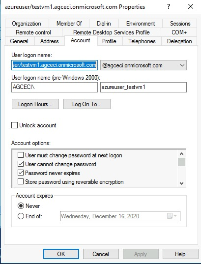
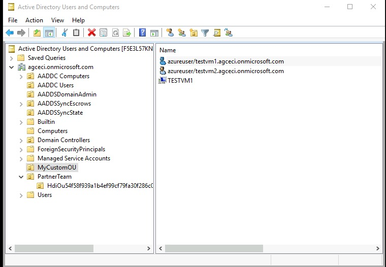
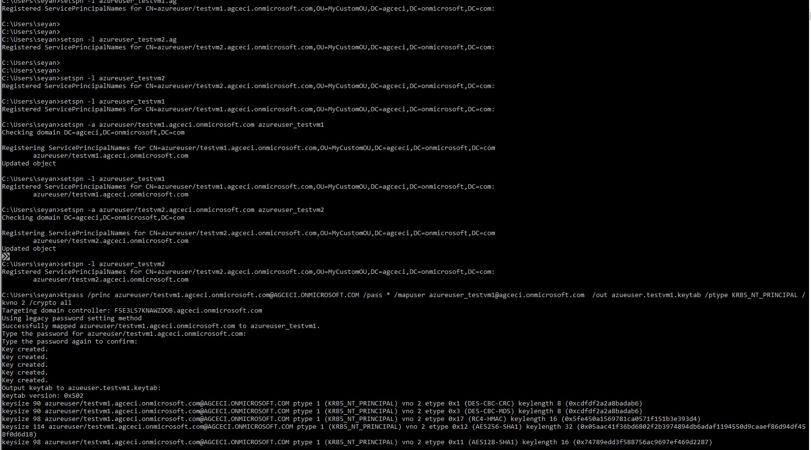
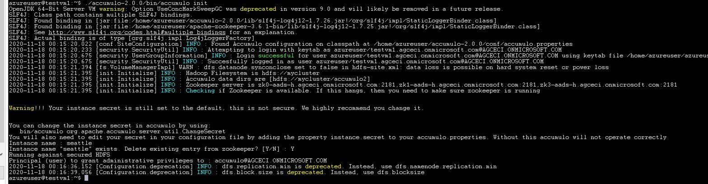
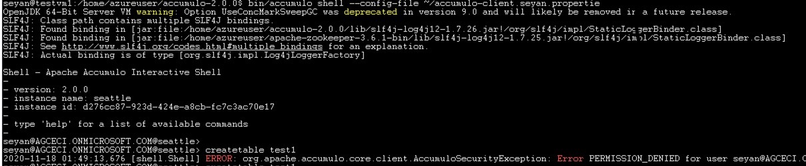
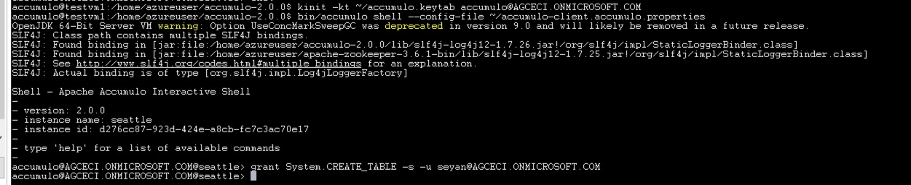

# Standalone Accumulo integrated with Azure Active Directory (AAD) and Domain Service, without Azure HDInsight Dependency

## Assumption
* You have already setup AAD and AAD Domain service, and domain service tools installed. A step-by-step tutorials are available to set up a Azure Active Directory Domain Services managed domain (https://docs.microsoft.com/en-us/azure/active-directory-domain-services/tutorial-create-instance, https://docs.microsoft.com/en-us/azure/active-directory-domain-services/tutorial-create-instance-advanced). Then, add a domain-join a windows server (https://docs.microsoft.com/en-us/azure/active-directory-domain-services/join-windows-vm), install management tools (https://docs.microsoft.com/en-us/azure/active-directory-domain-services/tutorial-create-management-vm), and configure secure LDAP (https://docs.microsoft.com/en-us/azure/active-directory-domain-services/tutorial-configure-ldaps).
* You have a HDFS available in your Azure VNET and in your subnet. 
* You have setup a Azure Linux VM (testvm1 in this experiment) in the same VNET and subnet.

## Create your OU
Login with AAD DC Administrator account to your domain-joined Windows Server you set up in the pre-requisites (https://docs.microsoft.com/en-us/azure/active-directory-domain-services/join-windows-vm). make sure to install management tools (https://docs.microsoft.com/en-us/azure/active-directory-domain-services/tutorial-create-management-vm).  In this experiment, we create a new organizational unit called `MyCystomOU`, where we add our new VM, linux users, and its corresponding service principals. Use the following reference document (https://docs.microsoft.com/en-us/azure/active-directory-domain-services/create-ou).


## Domain Join your Linux VM
In this experiment, we set up a Ubuntu VM and join the VM to our domain service. The step-by-step tutorial is available (https://docs.microsoft.com/en-us/azure/active-directory-domain-services/join-ubuntu-linux-vm). You would also find the adjusted instructions for other OS(s) in the same azure documentation tree. For exmaple, for CentOS, it would be the following (https://docs.microsoft.com/en-us/azure/active-directory-domain-services/join-centos-linux-vm).

Note that the instruction in the document would add your linux vm without the fully qualified dns name (FQDN). We modified & used the combination of realm and adcli to achieve the domain joined-vm with fqdn.
Change the username and domain name according to your realm & domain name. The initial adcli command may be found from the output of `realm join` command. Add --host-fqdn parameter to attach your FQDN.  

```
sudo realm join --computer-ou="OU=MyCustomOU,DC=agceci,DC=onmicrosoft,DC=com" -U "seyan@AGCECI.ONMICROSOFT.COM"  AGCECI.ONMICROSOFT.COM --user-principal=HOST/testvm1.agceci.onmicrosoft.com@AGCECI.ONMICROSOFT.COM --verbose  --install=/
sudo cp /etc/krb5.keytab /etc/krb5.keytab.bak

sudo realm leave --verbose AGCECI.ONMICROSOFT.COM -U 'seyan@AGCECI.ONMICROSOFT.COM'
sudo cp /etc/krb5.keytab.bak /etc/krb5.keytab
LANG=C /usr/sbin/adcli join --verbose --host-fqdn=testvm1.agceci.onmicrosoft.com --domain agceci.onmicrosoft.com --domain-realm AGCECI.ONMICROSOFT.COM --domain-controller 10.0.0.4 --computer-ou OU=MyCustomOU,DC=agceci,DC=onmicrosoft,DC=com --login-type user --login-user seyan@AGCECI.ONMICROSOFT.COM

```

## Add your vm linux user and associated service principal to your AAD domain OU.
Go back to your domain-joined Window Server. Open `Active Directory Users and Computers` under Control Panel > System and Security > Administrative Tools.
Add your vm user with `Active Directory Users and Computers`. Make sure to choose `User cannot change password` and `Password never expires` in Account options.



In this experiement, we add `azureuser_testvm1` as follows:
```
User logon name: azureuser@testvm1.agceci.onmicrosoft.com
User Logon name (pre-Windows 2000): azureuser_testvm1 
```
You now have your VM and linux account of your VM in your OU. 




Open windows terminal, create service principals and associate it with the user account you created.

```
setspn -a azureuser/testvm1.agceci.onmicrosoft.com azureuser_testvm1
```


And, generate the keytab file for the service pricipal with `ktpass` tool.
```
ktpass /princ azureuser/testvm1.agceci.onmicrosoft.com@AGCECI.ONMICROSOFT.COM /pass * /mapuser azureuser_testvm1@agceci.onmicrosoft.com /out azureuser.testvm1.keytab /ptype KRB5_NT_PRINCIPAL /kvno 2 /crypto all
```


Upload the generated keytab file to your Azure Storage account Blob for later downloading it from your VM (testvm1 in this experiement).

## Download your service principal keytab file on your test vm
Go back to your test vm and make sure you log in with the account for your accumulo service. You will download the service principal's keytab file and make it available for `accumulo master | tserver` process. In my case, I uploaded the keytab file to Azure Storage Blob, generate the SAS token, and downloaded with `wget` command.

## Hadoop Client and Zookeeper Client Dependency
Even though you are not running your own HDFS and Zookeeper service for your Accumulo, you still need to set up client libraries for Accumulo.
Download from apache.org and unzip.

```
wget https://downloads.apache.org/hadoop/common/hadoop-3.3.0/hadoop-3.3.0.tar.gz

wget https://archive.apache.org/dist/zookeeper/zookeeper-3.6.1/apache-zookeeper-3.6.1-bin.tar.gz

tar xvf hadoop-3.3.0.tar.gz
tar xvf apache-zookeeper-3.6.1-bin.tar.gz
```
Set your HADOOP_HOME variable to your unzip folder. Copy the core-site.xml and hdfs-site.xml from your HDFS service into `${HADOOP_HOME}/etc/hadoop` and update $`{HADOOP_HOME}/etc/hadoop/hadoop-env.sh`. My environment configurations include the followings:

```
export JAVA_HOME=/usr/lib/jvm/java-11-openjdk-amd64
export HADOOP_OPTIONAL_TOOLS="hadoop-azure"
export HADOOP_CLASSPATH="${HADOOP_CLASSPATH}:${HADOOP_HOME}/share/hadoop/tools/lib/*"
# get path to libssl by 'whereis libssl'
export HADOOP_OPTS="-Dorg.wildfly.openssl.path=/usr/lib/x86_64-linux-gnu/libssl3.so ${HADOOP_OPTS}"
```

In my experiement, I export "hadoop-azure" in $HADOOP_OPTIONAL_TOOLS variable because I reused the HDFS created thru Azure HDInsight in the previous experiment and its HADOOP client configuration includes wasb (https://hadoop.apache.org/docs/current/hadoop-azure/index.html).

I also updated `fs.defaultFS` in ${HADOOP_HOME}/etc/hadoop/core-site.xml so that my experment will re-use the external HDFS in Accumulo configuration. Update the value (e.g. `hdfs://mycluster` in this case) based on `dfs.internal.nameservices` value of your ${HADOOP_HOME}/etc/hadoop/hdfs-site.xml. 

```
    <property>
        <name>fs.defaultFS</name>
        <value>hdfs://mycluster</value>
        <final>true</final>
    </property>
```

## Accumulo Installation and accumulo-env.sh
Download Accumulo and upzip, or download your latest accumulo build from source.
```
wget "https://apache.osuosl.org/accumulo/2.0.0/accumulo-2.0.0-bin.tar.gz"
tar xvf accumulo-2.0.0-bin.tar.gz
```
In case you are downloading the 2.0.0 version, you need to replace `'accumulo-2.0.0/lib/accumulo-server-base-2.0.0.jar'` with the build with this recent patch (https://github.com/apache/accumulo/pull/1727/commits/b6a9ad000d261f201b6322031d34c60fcbbb9d5a). Otherwise, you will have when your kerberos cache gets expired eventually:

```
kinit: Ticket expired while renewing credentials
```

Update ${ACCUMULO_HOME}/conf/accumulo-env.sh with the correct HADOOP_HOME, ZOOKEEPER_HOME. Set CLASSPATH to include hadoop client,its tools lib, and zookeeper lib directories. 
```
CLASSPATH="${CLASSPATH}:${lib}/*:${HADOOP_CONF_DIR}:${ZOOKEEPER_HOME}/*:${HADOOP_HOME}/share/hadoop/client/*"
CLASSPATH="${CLASSPATH}:${HADOOP_HOME}/share/hadoop/tools/lib/*:${HADOOP_HOME}/share/hadoop/hdfs/*:${HADOOP_HOME}/share/hadoop/hdfs/lib/*"
CLASSPATH="${CLASSPATH}:${ZOOKEEPER_HOME}/lib/*"
export CLASSPATH
```

Include `Dorg.wildfly.openssl.path` in JAVA_OPTS.

```
JAVA_OPTS=("${ACCUMULO_JAVA_OPTS[@]}"
  '-XX:+UseConcMarkSweepGC'
  '-XX:CMSInitiatingOccupancyFraction=75'
  '-XX:+CMSClassUnloadingEnabled'
  '-XX:OnOutOfMemoryError=kill -9 %p'
  '-XX:-OmitStackTraceInFastThrow'
  '-Djava.net.preferIPv4Stack=true'
  '-Dorg.wildfly.openssl.path=/usr/lib/x86_64-linux-gnu/libssl3.so'
  "-Daccumulo.native.lib.path=${lib}/native")
```
## Update accumulo.properties
Update ${ACCUMULO_HOME}/conf/accumulo.properties with your service principal and keytab. In this experiment, I log in with `'azureuser'` and download the keytab file for service principal `'azureuser/testvm1.agceci.onmicrosoft.com`' in `'/home/azureuser/azureuser.testvm1.keytab'`. The corresponding configurations are:

```
instance.volumes=hdfs://mycluster/accumulo

## Sets location of Zookeepers
instance.zookeeper.host=${REPALCE_WITH_ZOOKEEPER_STRING_HERE}

## Change secret before initialization. All Accumulo servers must have same secret
instance.secret=DEFAULT
instance.security.authenticator=org.apache.accumulo.server.security.handler.KerberosAuthenticator
instance.security.authorizor=org.apache.accumulo.server.security.handler.KerberosAuthorizor
instance.security.permissionHandler=org.apache.accumulo.server.security.handler.KerberosPermissionHandler
general.kerberos.keytab=/home/azureuser/azureuser.testvm1.keytab
general.kerberos.principal=azureuser/_HOST@AGCECI.ONMICROSOFT.COM
instance.rpc.sasl.enabled=true
rpc.sasl.qop=auth
## Set to false if 'accumulo-util build-native' fails
tserver.memory.maps.native.enabled=false
trace.token.type=org.apache.accumulo.core.client.security.tokens.KerberosToken
## Trace user
trace.user=azureuser/_HOST@AGCECI.ONMICROSOFT.COM
## Trace password
#trace.password=secret
trace.token.property.keytab=/home/azureuser/azureuser.testvm1.keytab
general.delegation.token.lifetime=7d
general.delegation.token.update.interval=1d
```

## Initialize Accumulo
Accumulo init command will initialize accumulo service configuration on HDFS and set up an administrator account.  
```
kinit -r7d -kt ~/azureuser.testvm1.keytab azureuser/testvm1.agceci.onmicrosoft.com@AGCECI.ONMICROSOFT.COM
${ACCUMULO_HOME}/bin/accumulo init
```
Note that the admin account from Azure AD (i.e. accumulo@AGCECI.ONMICROSOFT.COM in this experiment) is given to `'Principal (user) to grant administrative privileges to :'` prompt below.


You may use the following command to drop the initialization from HDFS and re-run `'accumulo init'`.
```
${HADOOP_HOME}/bin/hdfs dfs -rm -r hdfs://mycluster/accumulo
```

## Start Accumulo

Run kinit and accumumo subsequently. Replace the domain and realm name with yours in the following example.

```
kinit -r7d -kt ~/azureuser.testvm1.keytab azureuser/testvm1.agceci.onmicrosoft.com@AGCECI.ONMICROSOFT.COM
# start the accumulo master
${ACCUMULO_HOME}/bin/accumulo master &
# start the accumo tserver
${ACCUMULO_HOME}/bin/accumulo tserver &
```
## Update accumulo-client.properties
This property file is used in accumulo initialization and accumuulo shell command.  

```
## Name of Accumulo instance to connect to
instance.name=seattle

## Zookeeper connection information for Accumulo instance
instance.zookeepers=${REPALCE_WITH_ZOOKEEPER_STRING_HERE}

## Authentication properties
## --------------
## Authentication method (i.e password, kerberos, PasswordToken, KerberosToken, etc)
auth.type=kerberos

## Accumulo principal/username for chosen authentication method
auth.principal=accumulo@AGCECI.ONMICROSOFT.COM

## Authentication token (ex. mypassword, /path/to/keytab)
auth.token=/home/azureuser/accumulo@AGCECI.ONMICROSOFT.COM.keytab

sasl.enabled=true
sasl.kerberos.server.primary=azureuser
sasl.qop=auth

```

## Run Accumulo admin shell with admin account
Open up another terminal and change to admin accouunt (accumulo@AGCECI.ONMICROSOFT.COM).
```
sudo su accumulo
```
Run the following sequence of commands with ktuitl to download keytab from Azure AD domain service. In my experiment, the admin account for Accumulo I gave in the initialization was 'accumulo@AGCECI.ONMICROSOFT.COM'.

```
ktutil
ktutil: addent -password -p accumulo@AGCECI.ONMICROSOFT.COM -k 1 -e RC4-HMAC
Password for accumulo@AGCECI.ONMICROSOFT.COM:
ktutil: wkt accumulo.keytab
ktuitl: q
```

Create accumulo-client.accumulo.properties for this account with the followings.
```
## Name of Accumulo instance to connect to
instance.name=seattle

## Zookeeper connection information for Accumulo instance
instance.zookeepers=${REPALCE_WITH_ZOOKEEPER_STRING_HERE}

## Authentication properties
## --------------
## Authentication method (i.e password, kerberos, PasswordToken, KerberosToken, etc)
auth.type=kerberos

## Accumulo principal/username for chosen authentication method
auth.principal=accumulo@AGCECI.ONMICROSOFT.COM

## Authentication token (ex. mypassword, /path/to/keytab)
auth.token=/home/accumulo/accumulo.keytab

sasl.enabled=true
sasl.kerberos.server.primary=azureuser
sasl.qop=auth
```

Run accumulo admin shell

```
kinit -kt ~/accumulo.keytab accumulo@AGCECI.ONMICROSOFT.COM
${ACCUMULO_HOME}/bin/accumulo shell --config-file ~/accumulo-client.accumulo.properties
```

Run the basic tests with followings:

```
accumulo@AGCECI.ONMICROSOFT.COM@seattle> createtable test1
accumulo@AGCECI.ONMICROSOFT.COM@seattle test1> insert a b c d
accumulo@AGCECI.ONMICROSOFT.COM@seattle test1> scan
a b:c [] d
accumulo@AGCECI.ONMICROSOFT.COM@seattle test1> flush -w
2020-11-04 22:06:10,864 [shell.Shell] INFO : Flush of table test1 completed.
accumulo@AGCECI.ONMICROSOFT.COM@seattle test1> scan
a b:c [] d
accumulo@AGCECI.ONMICROSOFT.COM@seattle test1> deletetable test1
```

## Run Accumulo user shell
Open up another terminal and change to noraml user account accouunt (seyan@AGCECI.ONMICROSOFT.COM).
```
sudo su seyan
```
Run the following sequence of commands with ktuitl to download keytab from Azure AD domain service. In this case normal user account from Azure AD I picked from my Azure AD is 'seyan@AGCECI.ONMICROSOFT.COM'.

```
ktutil
ktutil: addent -password -p seyan@AGCECI.ONMICROSOFT.COM -k 1 -e RC4-HMAC
ktutil: wkt seyan.keytab
ktuitl: q
```

Create accumulo-client.seyan.accumulo.properties for this account with the followings.
```
## Name of Accumulo instance to connect to
instance.name=seattle

## Zookeeper connection information for Accumulo instance
instance.zookeepers=${REPALCE_WITH_ZOOKEEPER_STRING_HERE}

## Authentication properties
## --------------
## Authentication method (i.e password, kerberos, PasswordToken, KerberosToken, etc)
auth.type=kerberos

## Accumulo principal/username for chosen authentication method
auth.principal=seyan@AGCECI.ONMICROSOFT.COM

## Authentication token (ex. mypassword, /path/to/keytab)
auth.token=/home/seyan/seyan.keytab

sasl.enabled=true
sasl.kerberos.server.primary=azureuser
sasl.qop=auth
```
After kinit,
```
kinit -kt ~/seyan.keytab seyan@AGCECI.ONMICROSOFT.COM
${ACCUMULO_HOME}/bin/accumulo shell --config-file ~/accumulo-client.seyan.properties
```

Run user shell
```
${ACCUMULO_HOME}/bin/accumulo shell --config-file ~/accumulo-client.seyan.properties
```

When you run the same test, you will see the permission denied error.

```
seyan@AGCECI.ONMICROSOFT.COM@seattle> createtable test1
ERROR: PERMISSION_DENIED
```


## Grant User Permission
Go back to the admin shell terminal and grant table creation permission to your user.

```
accumulo@AGCECI.ONMICROSOFT.COM@accumulo> users
seyan@AGCECI.ONMICROSOFT.COM
accumulo@AGCECI.ONMICROSOFT.COM
hive/hn0-aads-h.agceci.onmicrosoft.com@AGCECI.ONMICROSOFT.COM
accumulo@AGCECI.ONMICROSOFT.COM@accumulo> grant System.CREATE_TABLE -s -u seyan@AGCECI.ONMICROSOFT.COM
accumulo@AGCECI.ONMICROSOFT.COM@accumulo> 
```


## Verify you now able to create your test table and delete tables.
Go back to your user shell terminal and see if you may create a table without error.
```
seyan@AGCECI.ONMICROSOFT.COM@seattle> createtable test1
```

## Turn on the debug switch for kerberos debugging
Modify ${ACCUMULO_HOME}/conf/log4j.properties and ${ACCUMULO_HOME}/conf/log4j-service.properties.

```
log4j.rootLogger=DEBUG, console
```

Note that your will start to see this `KerberosTicketRenewal` in tserver log.

```
[KerberosTicketRenewal] DEBUG: Invoking renewal attempt for Kerberos ticket
```

